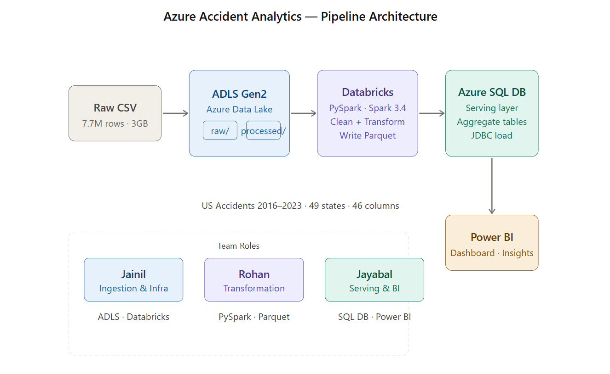

# Azure Accident Analytics

End-to-end data engineering pipeline on Microsoft Azure processing 7.7 million US traffic accident records (2016-2023).

## Architecture

Raw CSV -> Azure Data Lake Storage Gen2 -> Azure Databricks (PySpark) -> Azure SQL Database -> Power BI

## Dataset

- Source: [US Accidents (2016-2023)](https://www.kaggle.com/datasets/sobhanmoosavi/us-accidents/data) — Kaggle
- Size: 3GB, 7,728,394 rows, 46 columns
- Coverage: 49 US states, February 2016 to March 2023

## Tech Stack

| Layer | Technology |
|---|---|
| Storage | Azure Data Lake Storage Gen2 |
| Processing | Azure Databricks (Apache Spark 3.4.1) |
| Serving | Azure SQL Database |
| Visualization | Power BI Desktop |
| Version Control | GitHub |

## Repository Structure

- notebooks/ — PySpark notebooks for ingestion, transformation and SQL loading
- sql/ — DDL scripts for Azure SQL Database tables
- powerbi/ — Power BI dashboard (.pbix file)
- docs/ — Architecture diagram and project report
- screenshots/ — Pipeline screenshots from each stage

## Notebooks

| Notebook | Description |
|---|---|
| 01_ingest_explore.ipynb | Mount ADLS, read CSV, profile data, null analysis |
| 02_clean_transform.ipynb | Clean data, handle nulls, build 5 aggregate tables, write Parquet |
| 03_load_sql.ipynb | Load aggregate tables from ADLS to Azure SQL DB via JDBC |

## Aggregate Tables (Azure SQL Database)

| Table | Rows | Description |
|---|---|---|
| agg_by_state | 49 | Total accidents and avg severity per state |
| agg_by_severity | 4 | Accident count per severity level |
| agg_by_time | 84 | Accidents by year and month |
| agg_by_weather | 20 | Top 20 weather conditions and avg severity |
| agg_by_hour | 24 | Accidents by hour of day |

## Key Findings

- California has the most accidents with 1.74 million — 22% of all US accidents
- 79% of accidents are Severity 2 (moderate impact on traffic)
- Peak accident hours are 7am, 8am, 4pm and 5pm — rush hours
- Fair weather has the most accidents (2.5M) — people drive carelessly in good conditions
- Accidents grew steadily from 2016 to 2022 then dropped in 2023

## Power BI Dashboard

- Page 1 — Accidents by State (bar chart) and Severity Distribution (pie chart)
- Page 2 — Year Trend (line chart) and Accidents by Hour of Day (bar chart)
- Page 3 — Weather Conditions (bar chart) and Average Severity by Weather (bar chart)

## Pipeline Setup

1. Upload US_Accidents_March23.csv to ADLS Gen2 raw container
2. Run notebooks/01_ingest_explore.ipynb to explore data
3. Run notebooks/02_clean_transform.ipynb to clean and transform
4. Run notebooks/03_load_sql.ipynb to load aggregates to Azure SQL Database
5. Open powerbi/us_accidents_dashboard.pbix in Power BI Desktop

## Team

| Member | Role |
|---|---|
| Jainil Malaviya | Ingestion and Infrastructure Lead |
| Rohan | Transformation Lead |
| Jayabal | Serving and Visualization Lead |
